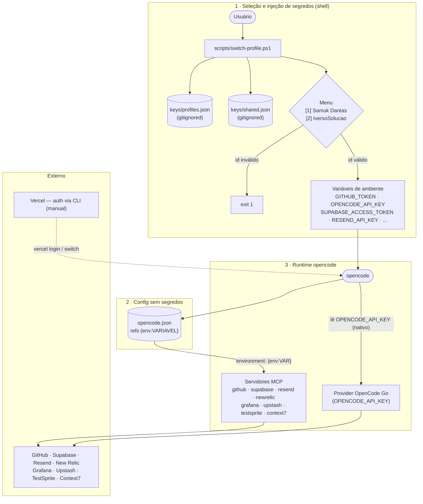
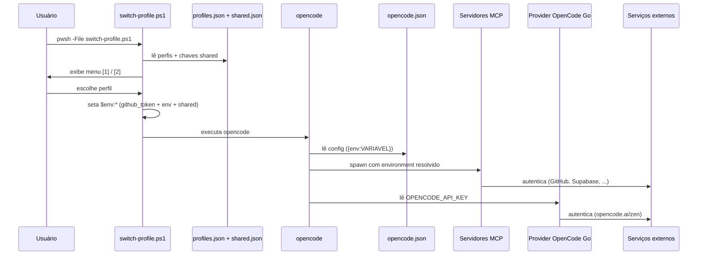

# Arquitetura do opencode-key-router

Roteador de chaves/perfis para os servidores MCP e providers do [opencode](https://opencode.ai), que permite alternar entre contas (ex.: `SamukDantas` e `IversoSolucao`) sem editar o `opencode.json`.

## Visão geral

O sistema é organizado em três camadas, com separação rígida entre **segredos** (arquivos gitignored) e **config** (versionável, sem tokens):

1. **Seleção e injeção de segredos** — o script `switch-profile.ps1` lê os perfis, pergunta ao usuário qual conta usar e seta as variáveis de ambiente antes de abrir o opencode.
2. **Config sem segredos** — o `opencode.json` referencia os valores via `{env:VARIAVEL}`, sem conter nenhum token.
3. **Runtime** — o opencode consome o config e as env vars, disparando os servidores MCP e o provider de modelo.

## Diagrama de fluxo



## Diagrama de sequência



## Decisões de arquitetura

| Decisão | Justificativa |
|---|---|
| Segredos fora do `opencode.json` | Config versionável sem expor tokens; `keys/` gitignored |
| `{env:VAR}` como contrato | Desacopla "quem define a chave" (script) de "quem a consome" (opencode/MCP) |
| Perfil = identidade completa | Um `switch-profile.ps1` resolve tudo (MCPs + provider + git) |
| `shared.json` separado | Chaves comuns aos perfis (ex.: Context7) — evita duplicação |
| Vercel fora do roteador | Auth é via CLI (`vercel login`/`vercel switch`), não env var — exceção explícita |
| Fallback `{file:}` | Plano B documentado caso `{env:}` falhe em `provider.options` |

## Estrutura de arquivos

```
opencode.json                 # config com {env:} (sem segredos)
scripts/switch-profile.ps1    # menu + carregamento dos perfis
keys/profiles.json            # (NÃO versionado) perfis com tokens reais
keys/profiles.example.json    # template de exemplo
keys/shared.json              # (NÃO versionado) chaves compartilhadas
keys/shared.example.json      # template de exemplo
```

## Segurança

- Os arquivos reais de chaves (`keys/profiles.json` e `keys/shared.json`) estão no `.gitignore` e **nunca** devem ser commitados.
- Se qualquer token for exposto, **rotacione-o** no painel do serviço e atualize o arquivo correspondente.
- Mantenha este repositório **privado**.
